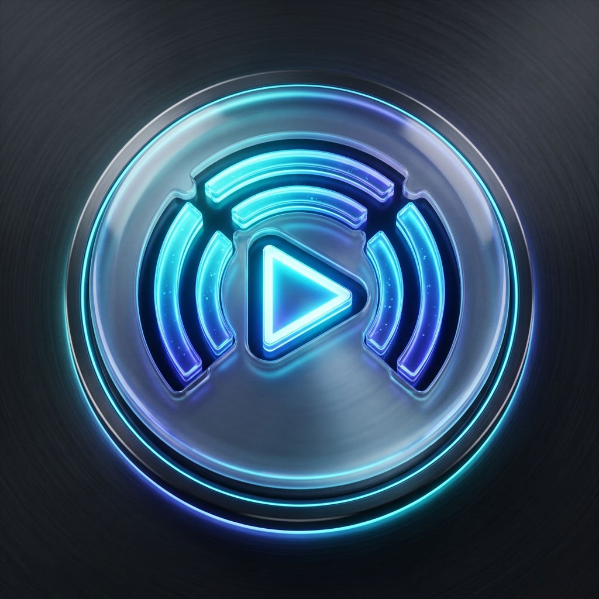
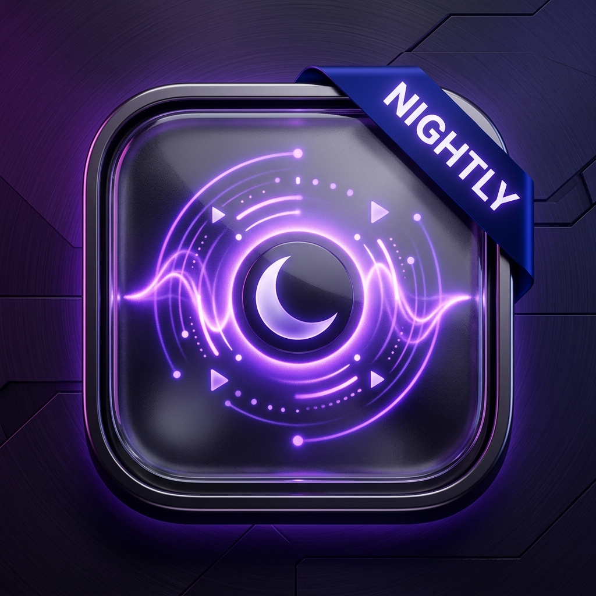
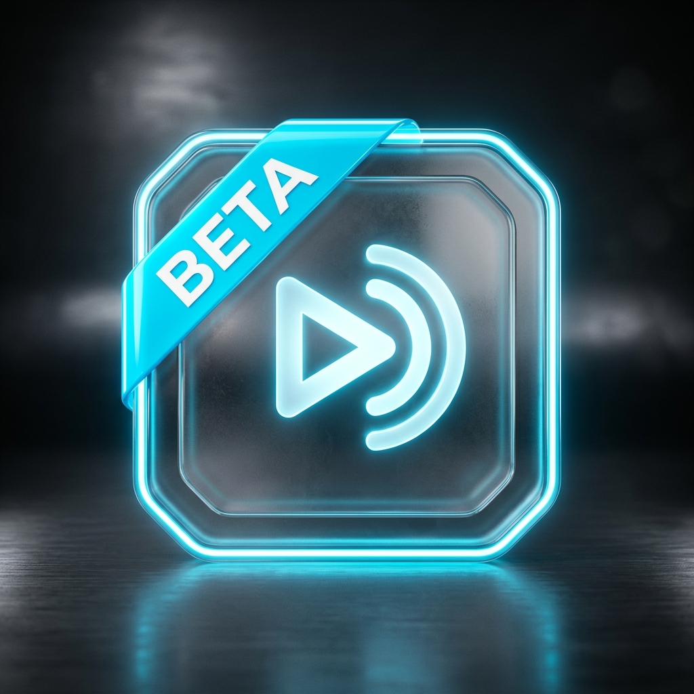
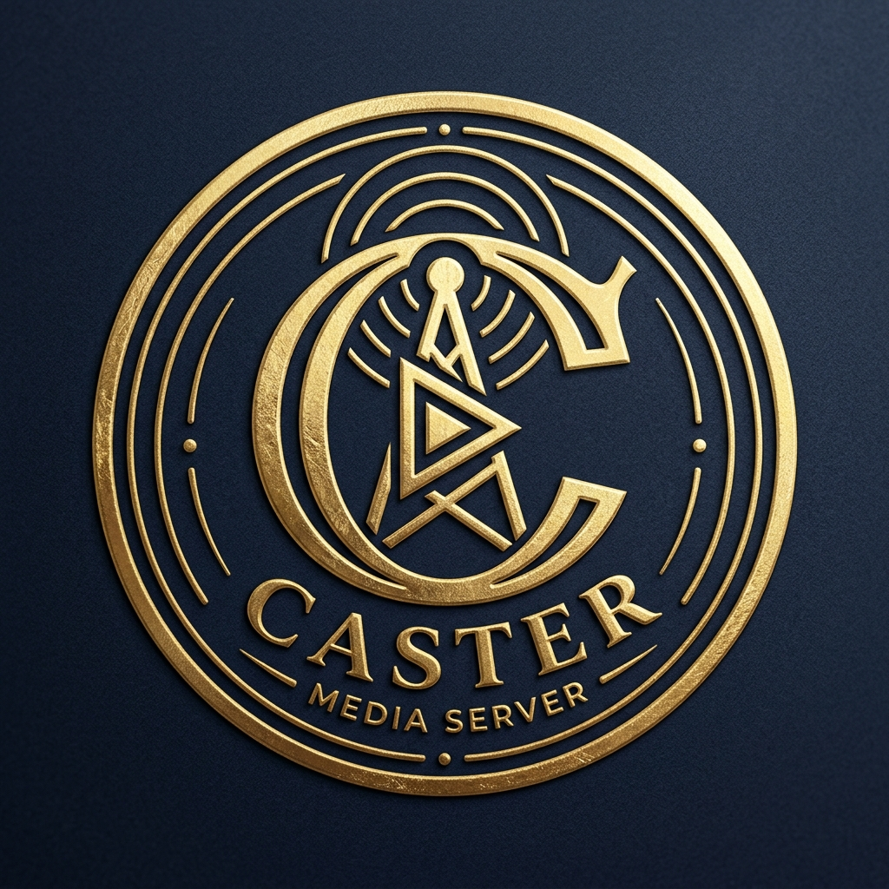
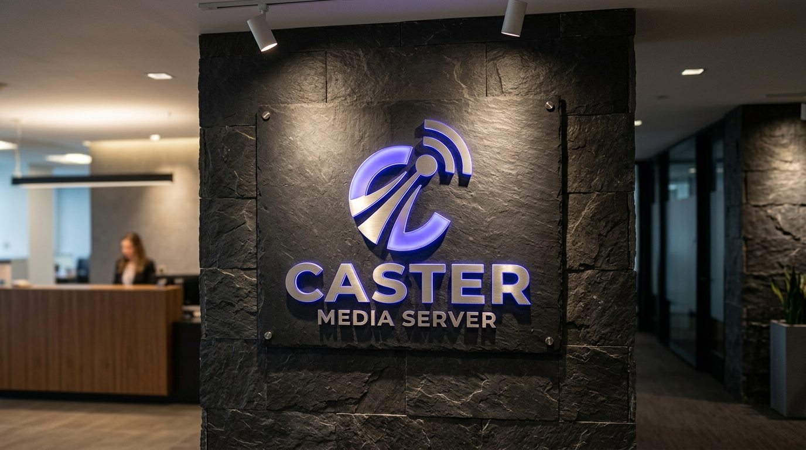
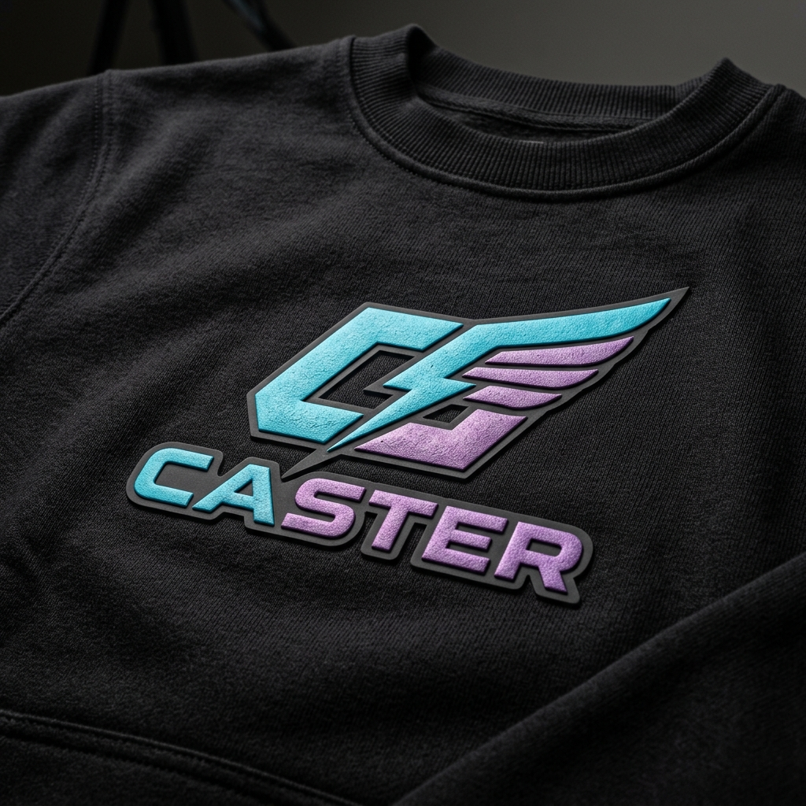

# Caster — Official Brand & Logo Asset Guidelines

## 1. Brand Essence & Vision
- **Brand Identity**: **Caster** is a high-performance, modern, self-hosted personal media streaming server designed for TrueNAS SCALE, Docker, and Tailscale private mesh streaming.
- **Design Archetype**: Futuristic Media Tech & Clean Precision (Neon Cyan, Electric Indigo, Deep Titanium).
- **Core Symbolism**: The Caster beacon combines a high-speed media stream playback prism with radiating broadcast waves, representing seamless, low-latency media delivery across devices anywhere in the world.

---

## 2. Color Palette System & Build Branch Accents

| Palette Role | Color Name | HEX Code | RGB | Purpose |
| :--- | :--- | :--- | :--- | :--- |
| **Primary Brand** | Electric Cyan / Indigo | `#38BDF8` / `#6366F1` | `56, 189, 248` / `99, 102, 241` | Core brand identity & Production release |
| **Nightly Accent** | Midnight Violet | `#8B5CF6` / `#C084FC` | `139, 92, 246` / `192, 132, 252` | Nightly build app icons & favicons |
| **Dev Accent** | Safety Orange | `#EA580C` / `#FDBA74` | `234, 88, 12` / `253, 186, 116` | Development / Debug build icons |
| **Beta Accent** | Electric Cyan | `#0EA5E9` / `#38BDF8` | `14, 165, 233` / `56, 189, 248` | Beta / Staging build icons |
| **Dark Neutral** | Slate Dark | `#0B0F19` / `#020617` | `11, 15, 25` / `2, 6, 23` | Dark mode background surfaces |
| **Luxury Gold** | Imperial Gold | `#EAB308` / `#CA8A04` | `234, 179, 8` / `202, 138, 4` | Luxury submark monogram seals & awards |

---

## 3. Application Build Branch Icon Matrix

| Production (`prod`) | Nightly (`nightly`) | Development (`dev`) | Beta (`beta`) |
| :---: | :---: | :---: | :---: |
|  |  |  |  |

---

## 4. Logo Lockup Catalog

### Primary Horizontal Lockups
- **Dark Mode**: `assets/branding/lockups/primary_horizontal/caster_primary_dark.svg`
- **Light Mode**: `assets/branding/lockups/primary_horizontal/caster_primary_light.svg`

### Secondary Stacked & Wordmark Lockups
- **Stacked Lockup**: `assets/branding/lockups/secondary_vertical/caster_secondary_stacked.svg`
- **Wordmark Only**: `assets/branding/lockups/wordmark/caster_wordmark.svg`
- **Standalone Logomark**: `assets/branding/lockups/logomark_symbol/caster_symbol.svg`

### Submark Monogram & Seals
| Monogram Vector SVG | Embossed Luxury Seal |
| :---: | :---: |
|  |  |

---

## 5. Digital & Social Media Assets

- **Web Favicon Suites**:
  - Production: `assets/branding/digital/favicons/branches/production/favicon-prod.svg`
  - Nightly: `assets/branding/digital/favicons/branches/nightly/favicon-nightly.svg`
  - Development: `assets/branding/digital/favicons/branches/development/favicon-dev.svg`
  - Web App Favicon: `apps/web/public/favicon.svg`
- **Social Avatar**: `assets/branding/social/avatars/caster_avatar.png`
- **Profile Banner**: `assets/branding/social/profile_banners/caster_profile_banner.png`
- **Mobile Splash Screen**: `assets/branding/digital/splash/branches/production/splash_production.png`

---

## 6. Physical, Merchandise & 3D Applications

| 3D Lobby Signage | Streetwear Apparel Mockup |
| :---: | :---: |
|  |  |

---

## 7. Logo Usage Rules & Clear Space

- **Minimum Clear Space**: Maintain at least `1X` the radius of the central broadcast beacon as clear space surrounding the mark on all sides.
- **Minimum Size**:
  - Digital displays: Minimum height 24px for horizontal lockup; minimum 16px for standalone logomark.
  - Print media: Minimum width 20mm for horizontal lockup.
- **Integrity**:
  - Do NOT distort, rotate, stretch, or alter the geometric proportions.
  - Do NOT apply non-brand color gradients or unapproved shadows.
  - Maintain high contrast against surrounding backgrounds (use Dark lockup on dark themes, Light lockup on light themes).
